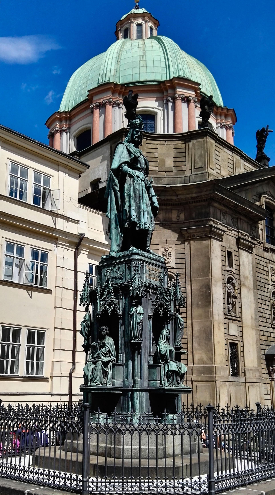
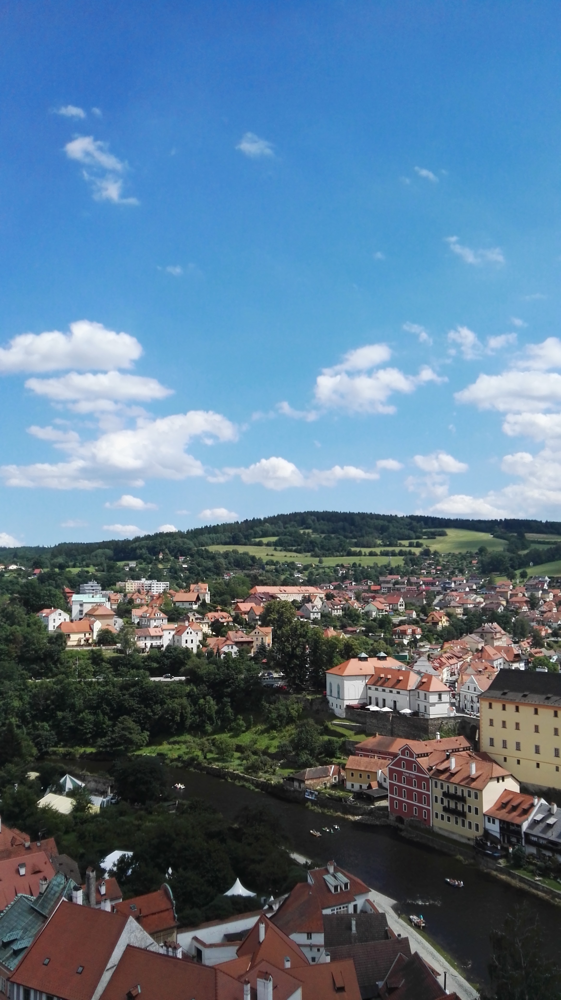
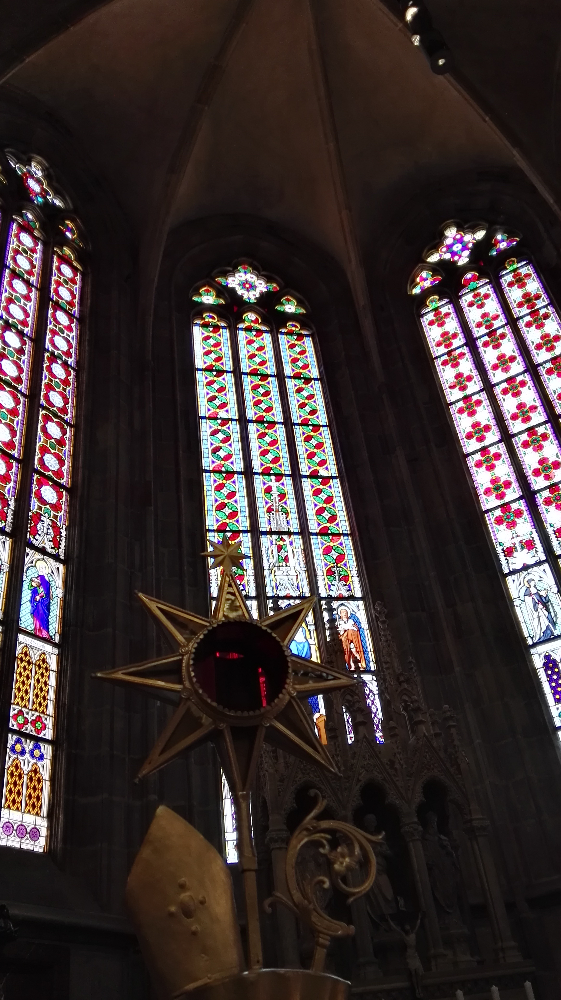
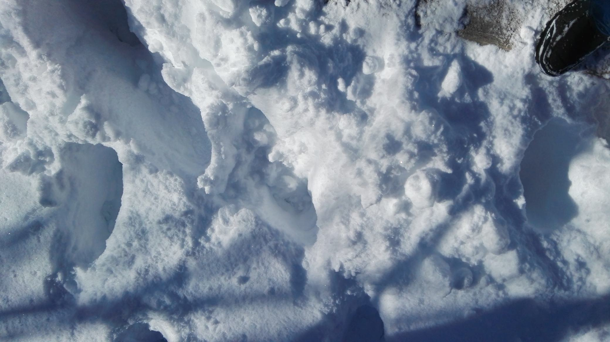
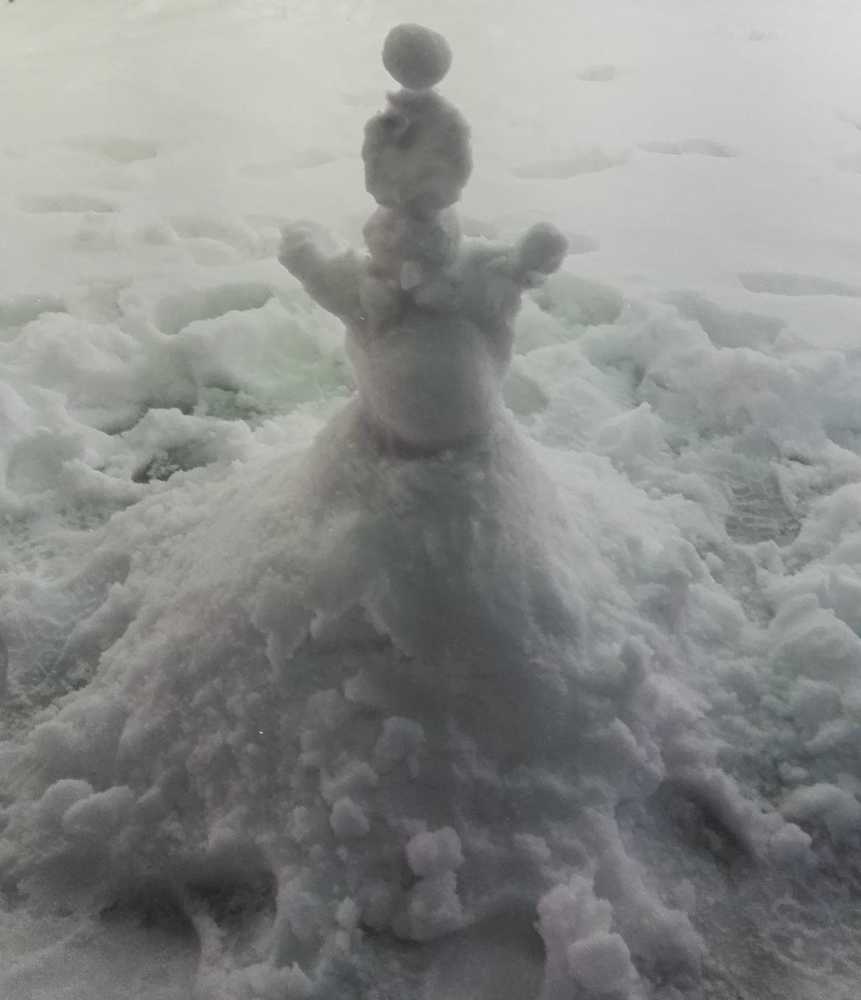
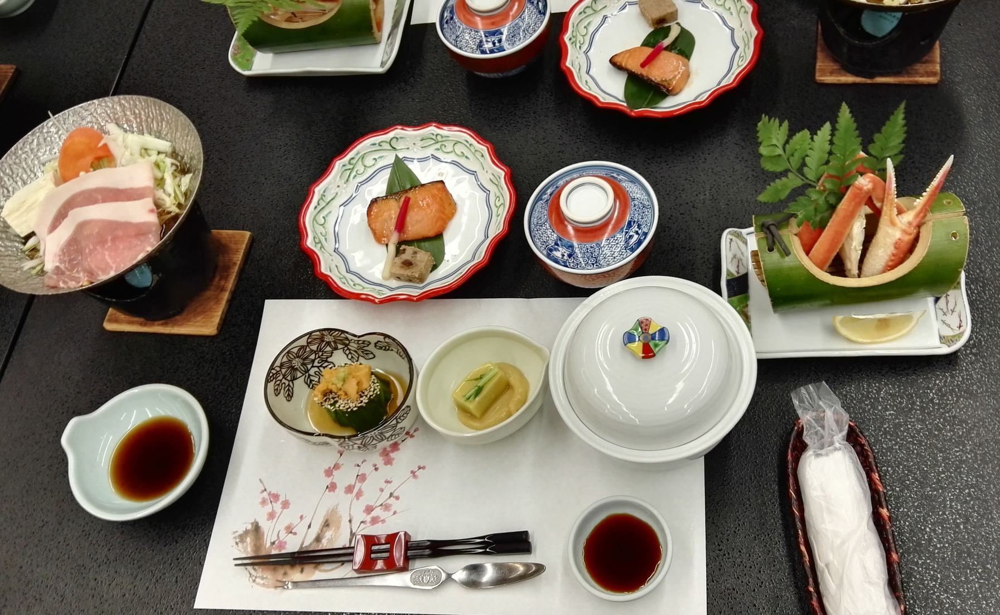
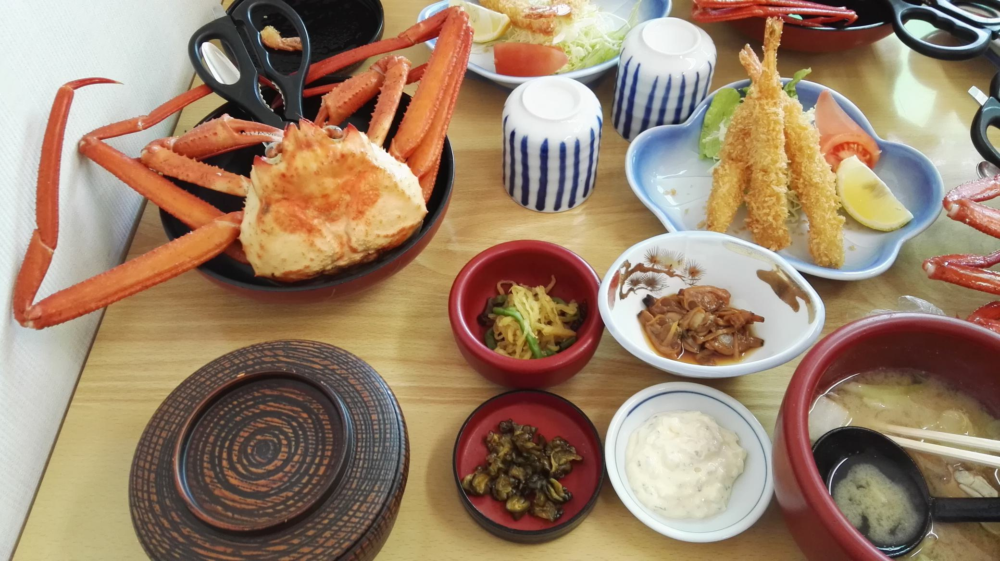

# 这里是周游世界的回忆录

回想起来，我真的去了好多好多地方。人类世界中有八大洲，我去过其中三个（哎呀也不多嘛）。

那就想起什么写什么吧~

## 东南亚

好小的时候去的了。记忆中这些地方都是.......大沙滩，大海，大船，大海鲜（hhhhh）

### 新加坡&马来西亚

记得那里有很好吃的士多啤梨雪糕。

### 菲律宾

潜水好玩嘿嘿。看见了海蛇（害怕）

## 美国

说是美国，其实我只去过美西。

黄石公园的景色太美了！这辈子一定要再去一次！

## 欧洲

### 希腊

2023记：

好像有八年前了吧。地中海边的天色无比湛蓝。爱琴海的日落是我看过最美的日落（纯粹意义上的美）。

### 意大利

一切都有浓郁的西方艺术气息。罗马竞技场很震撼！

### 东欧

波兰、捷克斯洛伐克、奥地利... 啊啊啊不记得了！

盐矿好好玩。好多皇宫。

* 那时候的拍照技术真的...一言难尽。能看的只有这么一点点了！

|  |  |  |
| ------------------------------------------------ | ------------------------------------------------ | ------------------------------------------------ |
| 不知道什么雕像...                                | 不知道什么小镇...                                | 不知道什么教堂...                                |

## 英国

中考完的暑假来了这里！亲眼看到了传说中那颗砸牛顿的苹果树。我也想要祖师爷那么智慧的脑袋！！！

## 日本

去过两次~

很快乐的新泻游学！最青春的年纪和最美好的同学友谊都在那个时空~

|  |  |
| --------------------------------------------- | ------------------------------------------------ |
| 南方的孩子看到雪很兴奋~                       | 堆雪人                                           |

|                |  |
| ------------------------------------------------------------ | ---------------------------------------------- |
| 好吃的*1 好多没见过的东西。什么，原来是刺身？！被我放到小锅里煮熟了呜呜 | 天妇罗&好大的蟹！                              |

第二次...狠狠的在秋叶原买东西！逛了三天三夜，收获了一个行李箱的手办（喂喂不许嘲笑我哦！）

## 结语

周游世界虽然难以称作“梦想”，但确实是我这辈子想做的事情。

有些地方虽然我尚未涉足，但这辈子决定一定要去一次（嗯）。

* 我想去世界的尽头——冰岛。烈焰与冰川的交融无比瑰丽。自然所渲染的、雕刻的一切都太过迷人。
* ......

