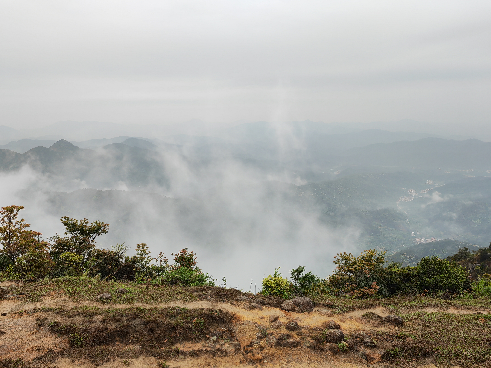

## 因为还只有一篇，所以就先写在这里啦——

# 是企鹅.肖恩的天水出线的感想 23/4/15

​    出线前前后后这段时间都忙薯了啊啊啊啊啊啊作业一堆根本写不完呢饶了我吧（苦笑）。不过把一些烦恼焦虑都留在了山上，出一次线能带来很大的治愈啊。下面是一些朴素的碎碎念：

## 出线前

其实很早就开始准备了，毕竟之前因为某新冠没赶上冬训，要出一次线还是非常兴奋的。对着装备清单发现登山包、头灯之类的东西都还没买，于是直接买了一身装备（所以不去出线就白买了嘛/咕掉了一些周末本来的安排）。

因为ddl实在是太多了，出线前面两周都没怎么来训练+熬夜爆肝作业，临出线两天还感冒了，临时磕了点药幸好好过来了（吓薯我了/但是还是有点虚其实）。

## 然后开始天水的穿越

​    那天六点多开始出发。翘了节课，回宿舍洗了个澡就匆匆出门了。五点多我第一次背起装满了的65L登山包（当时感觉是生命难以承受之重了属于是），估摸着由十几快二十公斤吧可能，都有我三分之一那么重了。光是骑个车去门口就肩膀巨酸（流泪）。给学长看了看才发现背包什么地方都没调对呢。最后还是因为太瘦了腰封束不紧（第一次希望肚子长一点点肉）。然后就上车了，一直坐到快十一点才到营地附近（没吃晚饭给我饿扁了已经）。搭好帐篷之后狂炫路餐，导致了之后两天路上食物匮乏的惨剧。

​    第一天晚上是我第一次真正意义上的露营（还是睡三个人的帐篷耶）。外面有点下雨，风有点大。不知道是不是不太习惯睡帐篷，以及前几天熬夜的原因，躺在帐篷里面横竖睡不着，睡着了也是呈以1小时为频率地苏醒，标准差不超过5分钟吧（突兀）。

​    第二天起来…把带的唯一一件长袖绑在腰上，终于让腰封束上去了！但是感觉路走起来还是异常艰难啊，毕竟以前没背过这么重的包走路呢（叹气）。一开始的那段山路走的想薯了简直，，，（捂脸）。快到山顶终于习惯了一点点。

​    上到第一个山顶开始风雨交加，好冷！后悔没带够衣服了，把雨衣穿上当成长袖还是好冷，感觉已经失去血色了。不过风景非常好。云雾，草甸和满山的花治愈了爬山的伤痛（精神治愈物理实在！好吧可能是因为激素）。

 

|  |  |  |
| ------------------------------------------ | --------------------------------------- | ------------------------------------------- |
| 云雾  （可惜放不了动态的）                 | 草甸（超治愈！）                        | 花花花花花！！                              |

 

之后就是最库鲁西的爬上爬下过程了。不知道是因为下雨了还是我的鞋底不够坚强，感觉它好滑，所以只能怼着两根登山杖才敢走。又累又饿（呜啊）一度萌生出“不如把我鲨了吧/我只要活着下山就好了”的念头。中途吃了点东西但是还是好饿（好饿）。

不过，在吃午餐的地方一个人坐了一会儿，那一刻好像整片天地就属于我一样，手脚可以没有限制地想远方伸展，视线也可以不受阻碍的直洞无穷，来爬山不就是为了这个吗（大声）。戴上耳机，再放几首喜欢的歌，小声跟着哼一哼（风这么大应该没人听得见吧（放心））。人生顶级享受*

顺便补一句，（好像是）鲍鱼的葡萄干味道很不错耶。

然后继续开始无穷。无尽的爬坡。到了公路上，路还是没有尽头地延伸着。一路上都走在队尾了（实在没有力气走到前面去了唔）。过于狼狈了。哪怕路上看到了很可爱的牛牛也没办法打起精神了。不过在后面还是有些好处的啦。公路上和飞天猪，小叶同学，葱花以及看起来像是来摸鱼的siri聊了一会儿天。感觉好久没和人类说过那么多话了，偶尔说说话的感觉真不错啊。一路上找话说真是辛苦你们了。后来饿扁了又休息了一会儿。（三十的牛肉干和siri的脆脆鲨真的救大命了！！含泪感谢）。

剩下的因为累的精神恍惚了已经想不太起来了。反正最后苟到营地了，没有薯在半路真的是太棒了！（自我安慰）。

晚上吃火锅嘎嘎炫面饼，可能加起来吃了有两三个面饼吧（第一次觉得面也纳摩好吃），全程几乎都在吃面。终于吃了一顿饱的！幸好清汤锅这边大家都斯斯文文的，要抢吃的话我可能吃不到什么吧，他们抢食的场面真可怕啊。

然后是夜聊。衣服没带够晚上又被冷到了，不过siri和鲍鱼的睡袋很暖和！大家围着坐也感觉很暖和。嗯，被起了一个名为肖恩的外号，源于小羊肖恩。就普遍理性而论，这个外号还是好听的（虽然还是更习惯大家叫我企鹅吧）。然后，为了让大家知道我叫企鹅（大声！），于是唱了几首歌（捂脸）。（惊讶一下，葱花会唱《够钟》，三十会唱《罗生门》耶，感觉平时会一些粤语歌的人已经是稀有生物了！）然后声明一句，我平时不说话真的不是为了保护嗓子！只是我想不出来说什么话（社恐人），你们来找我说话我是会回话的！

晚上睡了个好觉！一觉睡到天亮了！（今年第一次那么早睡耶）

虽然天阴阴的没有看见日出，但是，早上起来，直接在火上烤午餐肉吃了，很满意的早餐！（好好吃真的）。然后在营地到处闲逛，逛，逛（惬意）。拍下了这个！

下山就比较轻松了，卸下三升水和消耗了很多食物之后真是轻了好多。虽然下雨了路很滑也很难走，但是没有那种累的要薯的感觉嘞。（以下省略一大段下山过程…）。在山脚被毒菇投喂了一个很苦很苦的绿色果实（很苦！），最后只吃了两口。然后倚在桥边一边摸鱼一边看暗暗看大家打闹（很有趣嘛）。午餐是前一天晚上毒菇给的面包和大枣给的压缩饼干（再次含泪感谢）。

最后的晚饭。斯文。好吃。开心。来了一些前辈。吃完回宿舍躺尸~

（回去有空一定好好训练，，，）
